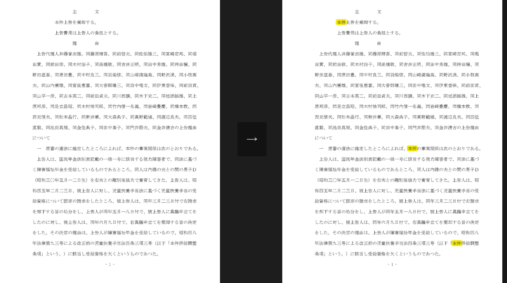
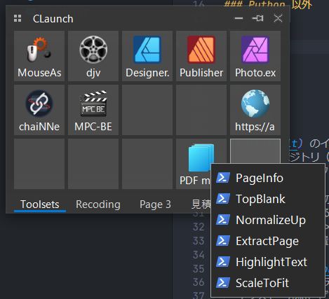

堀木事件の判例全文

# もくじ

- はじめに
- 設定動画
- 前準備
- 使い方

## はじめに

これは cpdf と python と powershell とを使って pdf の操作、閲覧を楽にするためのスクリプト集積所です。  
思い付きと提案によって今後いろいろ増えていきます。  
目玉はテキストのハイライト機能、そのうちハイライトの色も指定可能になる予定。  
使用の際は[Claunch](http://hp.vector.co.jp/authors/VA018351/claunch.html)との併用で、以下のようにスクリプトを呼び出すことを強く推奨



## 設定動画

### Python 以外

まだ

### Python

まだ

## 前準備

- [Git](#Git) のインストール  
  ->このリポジトリ（フォルダ）を Clone（コピー）するのに必要  
  インストールはデフォルト設定のままでよい

- [cpdf](#cpdf) のダウンロード、Path 設定  
  ->cpdf を使用するために必要  
  システム環境設定 > 環境変数 > Path(上のほう)  
  に cpdf.exe が置いてあるディレクトリを追加する必要がある

- [Python](#Python) のインストール  
  ->テキストにハイライトを打つために必要  
  インストール時、どっかのタイミングで Add to PATH みたいな設定にチェックを入れる必要あり

- [Powershell](#Powershell)の関連付け、実行ポリシー変更  
  ->ps1 ファイル実行に必要  
  powershell はデフォルトで windows に入ってるはず

### Git

> https://git-scm.com/download/win

1. 64-bitGit ～～～～をダウンロード、インストール（デフォルト設定のままでよい）
2. Powershell などのターミナルを Win メニューから実行  
   `git -help`  
   と入力して Enter、赤文字じゃないものが出れば成功

### cpdf

> https://github.com/coherentgraphics/cpdf-binaries/tree/master/Windows64bit

1. cpdf.exe をダウンロード
2. `C:/bin/cpdf`というディレクトリを作って、そこに cpdf.exe を配置（実はどこでもいい）
3. システム環境設定 > 環境変数 > Path(上のほう) > 追加  
   そこに cpdf.exe を配置したフォルダのパス(今回の場合`C:/bin/cpdf`)を入力して決定
4. Powershell などのターミナルを Win メニューから実行  
   `cpdf -help`  
   と入力して Enter、赤文字じゃないものが出れば成功

### Python

3.10.x を推奨  
venv は使いません！

> https://www.python.org/downloads/windows/

1. Python 3.10.x(3.10.11 を推奨) の、Download Windows Installer 64bit をダウンロード
2. Install Now でインストールするが、どこかに出てくる Add Python.exe PATH みたいな項目に必ずチェックを入れること
3. Powershell などのターミナルを Win メニューから実行  
   `python -h`  
   と入力して Enter、赤文字じゃないものが出れば成功
4. 引き続きターミナルに以下のコマンドを入力、Enter  
   `pip install argparse pikepdf PyMuPDF`
   何事もなく終了すれば成功

### Powershell(ps1 関連付け)

1. Win メニューに powershell と入力
2. 出てきたやつを右クリックし、ファイルの場所を開く
3. 開かれたフォルダのショートカットのうち、x86 じゃないほうを右クリック、ファイルの場所を開く
4. 開かれたフォルダの上のアドレスバーをクリック、パスをコピー
5. 任意のところに`ゴミ.ps1`というファイルを作成（新規テキスト > .txt ごと変更などでよい）
6. Shift + 右クリック > プログラムから開く > PC でアプリを選択  
   上のアドレスバーに 4.のコピーしたアドレスを貼り付け、Enter  
   powershell.exe を選択
7. `ゴミ.ps1`がダブルクリックで黒い画面が一瞬出れば成功  
   `ゴミ.ps1`を削除して終わり

### Powershell(Execution)

1. Win メニューに powershell と入力
2. 出てきたうち、管理者として実行を選択し  
   `Set-ExecutionPolicy RemoteSigned -Scope CurrentUser -Force`  
   を貼り付け、Enter

## 使い方

どこか任意の場所で右クリック、ターミナルで開く、から

```
git clone https://github.com/NakGummy/Tools
```

をターミナルで実行し  
各種 ps1 ファイルを実行すると、入力するものを指定されるので、それに従って入力していけば結果が得られます  
うまく動かなかったり、わからなければリアルで連絡ください

### 入力例

入力 pdf パス -> `"C:\Users\user\Downloads\xxx_input.pdf"`  
出力 pdf パス -> `"C:\Users\user\Downloads\xxx_output.pdf"`  
範囲 -> `1-2`, `1,2,3,5-7`, `99`  
サイズ -> `a4portrait`, `a3landscape`, `usletterlandscape`  
ワード -> `撤去`, `▲`, `よつば`
